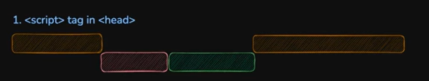
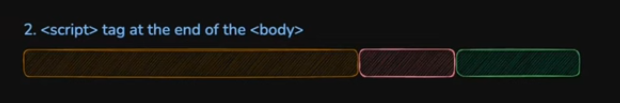
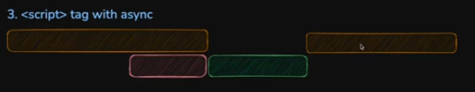
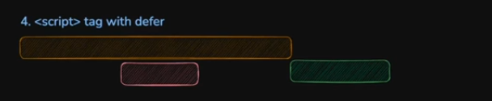

This video covers the following topics:

- ✅ The 40 Days of JavaScript
- ✅ The Progress Tracker template
- ✅ JavaScript & It's History
- ✅ Environment Setup
- ✅ First Line of JS Code
- ✅ Include Script in the head tag
- ✅ Problem with including the script in the head tag
- ✅ Including script in the body tag
- ✅ The async attribute
- ✅ The defer attribute
- ✅ Running JavaScript on the Server side
- ✅ Task Assignments and What’s Next in Day 02?

# 1. script tag is inside head tag

- Download html and build DOM.
- Download script and execute that script.
- Again download remaining html and build DOM.

# 2. script tag is inside end of body tag

- Download entire html and build DOM.
- Download script and execute that script.
- Disadvantage: To download and execute javascript we have to wait until entire html get parse and build DOM.

# 3. script tag with async

- Script gets downloaded in parallel with html downloading abd building DOM.
- Once the script is downloaded, immediately at that point pause the downloading html and building DOM, the script get executed immediately.
- After the script execution is done, remaining html parsing and building DOM takeplace.

# 4. script tag with defer

- Script gets downloaded in parallel with html downloading abd building DOM.
- Once the script is downloaded, it does not get executed immediately.
- it defer or wait till entire html gets download and build DOM.
- Once entire html gets download and building DOM is completed then its executed script.
